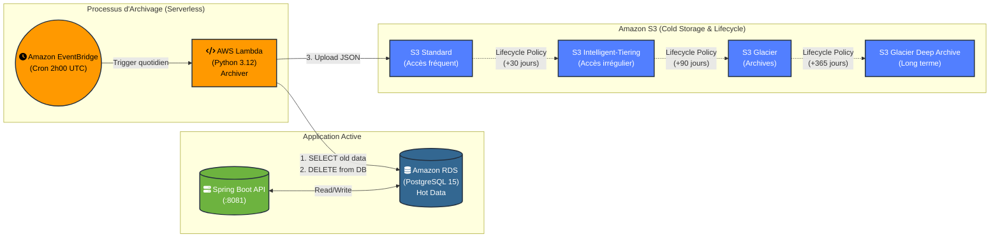

# 🏗️ Architecture du Projet : Intelligent Data Archiving Platform

Cette plateforme utilise une architecture Serverless et des services managés AWS pour automatiser l'archivage des données froides, garantissant ainsi la conformité et la réduction des coûts de stockage.

## Flux de données

1. **Production** : L'API Spring Boot insère et consulte en continu les données chaudes (Hot Data) dans la base de données PostgreSQL (Amazon RDS).
2. **Déclencheur** : Tous les jours à 2h00 du matin, Amazon EventBridge déclenche la fonction AWS Lambda de manière asynchrone.
3. **Extraction** : La Lambda exécute une requête SQL pour récupérer les anciennes données (ex: Logs de plus de 30 jours, Factures payées) et les supprime de la base RDS pour libérer de l'espace.
4. **Stockage Initial** : La Lambda formate ces données en JSON et les téléverse dans le bucket S3 (S3 Standard).
5. **Cycle de Vie (Cost Optimization)** : S3 applique automatiquement ses politiques de cycle de vie (*Lifecycle Policies*) :
   - Après 30 jours : Migration vers **Intelligent-Tiering**
   - Après 90 jours : Migration vers **Glacier Flexible Retrieval** (Archives)
   - Après 365 jours : Migration vers **Glacier Deep Archive** (Conservation à très long terme, coût minimum)
